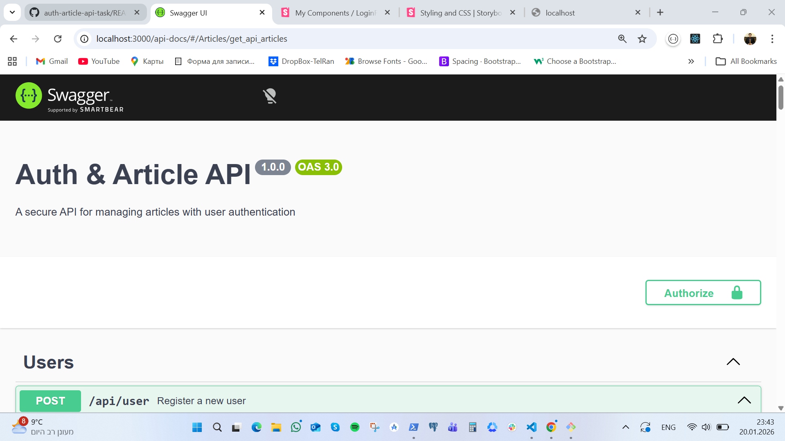
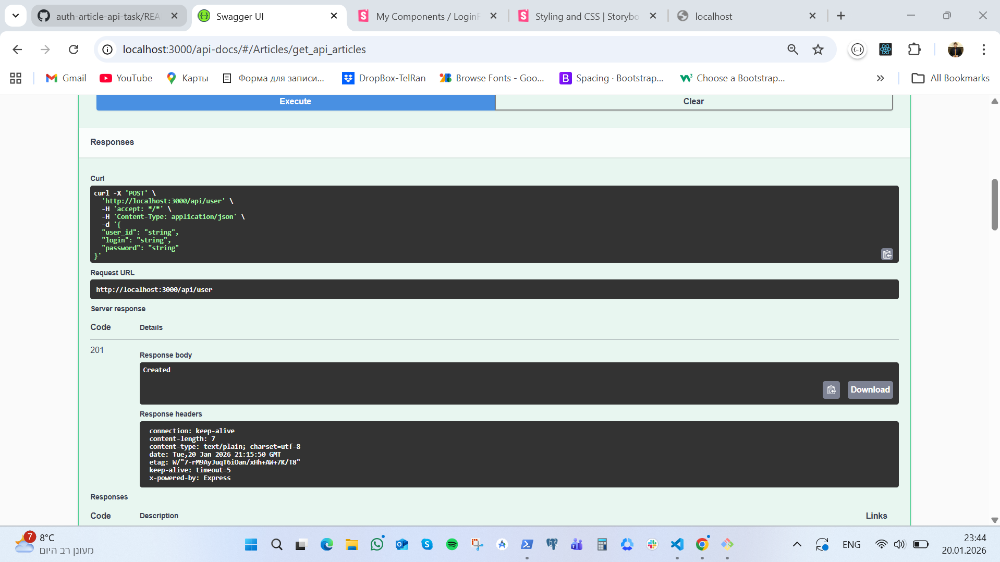
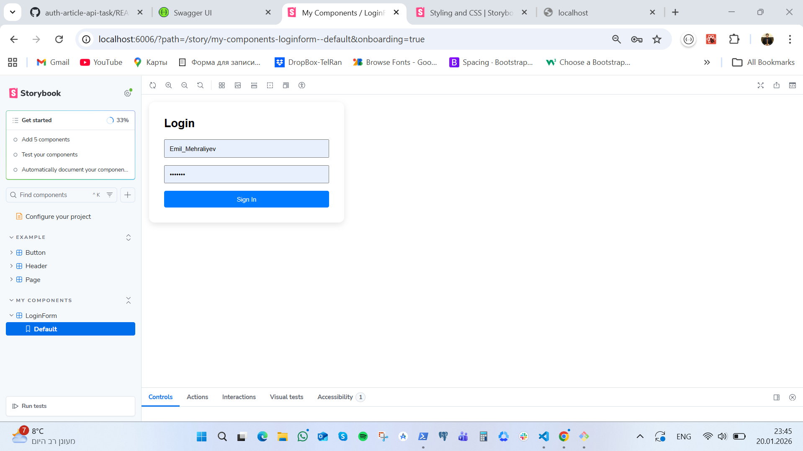

# Auth & Article API Task

Full-stack application featuring a Node.js/Express backend and a React/TypeScript frontend. This project demonstrates API documentation with **Swagger** and UI component development with **Storybook**.

## 🛠 Features

- **Backend**: Express.js with TypeScript, JWT Authentication.
- **API Documentation**: Interactive Swagger UI.
- **Frontend**: Vite + React + TypeScript.
- **UI Development**: Storybook for component isolation and documentation.
- **Validation**: React Hook Form for efficient form handling.
- **Fail-Fast**: Input validation before expensive operations.  

---

## 📸 Visual Documentation

### Interactive API Docs (Swagger)


*Access at: `http://localhost:3000/api-docs`*

### Component Playground (Storybook)

*Run with `npm run storybook` in the `/frontend` directory.*
---


## 🚀 Getting Started

### 1. Clone and Install
```bash
git clone [https://github.com/Emil4ik400/auth-article-api-task.git](https://github.com/Emil4ik400/auth-article-api-task.git)
cd auth-article-api-task
npm install
cd frontend && npm install

## 🚀 How to Run

### Backend
1. `npm install`
2. `npx ts-node index.ts`
*Use the `test.http` file or Swagger UI to verify endpoints.*

### Frontend & Storybook
1. `cd frontend`
2. `npm install`
3. `npm run storybook`